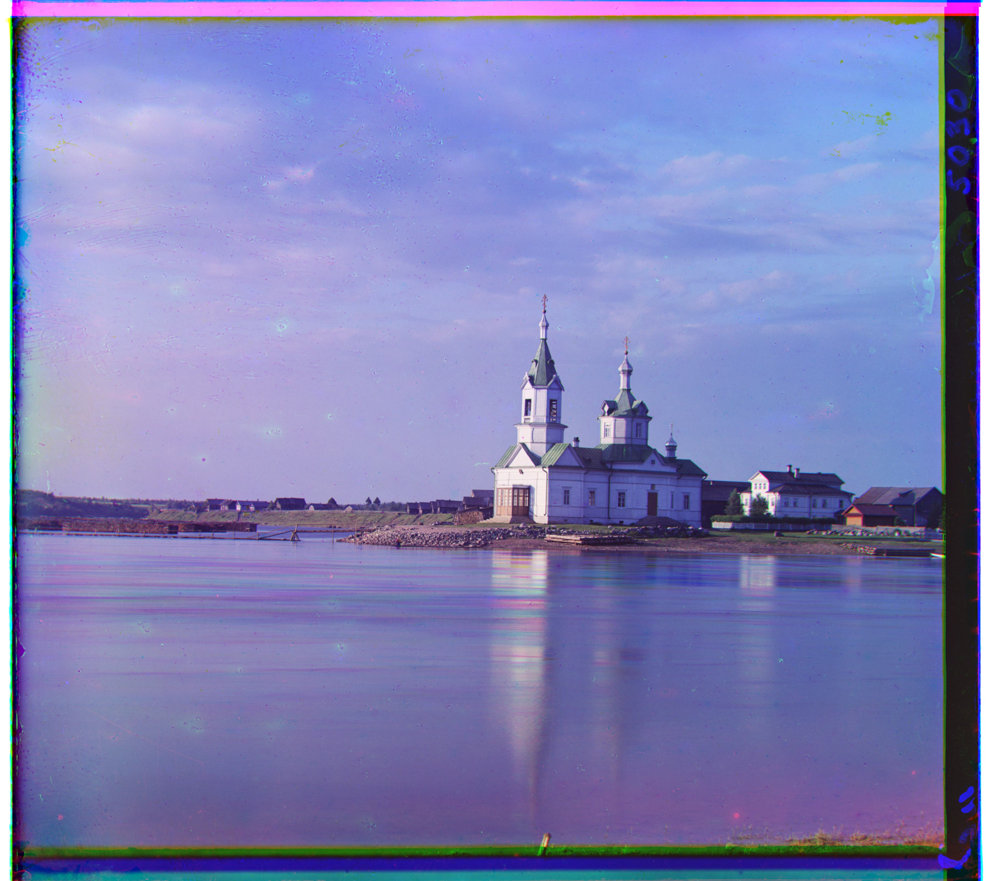
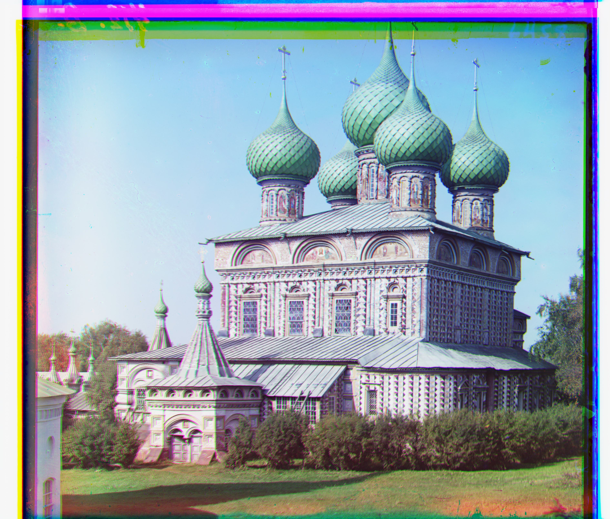

# Project1: Colorizing the Prokudin-Gorskii photo collection
## Overview
The goal of this project is to take the digitized Prokudin-Gorskii glass plate images and, using modern image processing techniques, automatically produce a color image with as few visual artifacts as possible.
## Algorithm Implementation
### Aligning Method
For smaller images, I use the blue channel as a baseline, iteratively enumerate shifts([-15, 15]) in other channels, and compare the shifted images with the baseline image to identify the smallest difference as the result. Initially, I used the L2 norm difference between two images as the metric for evaluating differences. Although this metric can successfully match some images, it lacks adaptability and sensitivity to differences, because the values in the RGB channels can vary significantly and cannot be directly calculated at the pixel level. Subsequently, I utilized the Sobel operator to calculate the gradient information of both images. I chose the 3*3 Sobel kernel size to get finer details of gradient. The difference in gradient information between the two images serves as the evaluation metric. This method is advantageous because the gradient direction of the same images tends to be similar, allowing for better alignment of the images.
### Speed up Method
However, for larger images, the time it takes to calculate differences for a single image becomes excessively long, making the time spent on enumerating shifts 31*31 times unacceptable. Because the distance moved at low resolution is longer than at high resolution, I recursively reduce the image size by half and calculate the offset at the lower resolution, doubling the offset at the end of each recursion. By reducing the search range to [-2, 2], for 4K resolution images, the recursion depth does not exceed 8. This algorithm significantly reduces the computational load while maintaining the same excellent performance in results.
## Result Gallery

    

        
        
cathedral g_shift: [5, 2], r_shift: [12, 3]

    

    

        
        
church g_shift: [25, 3], r_shift: [58, -4]

    

    

        
        
emir g_shift: [49, 24], r_shift: [106, 42]

    

    

        
        
harvesters g_shift: [56, 11], r_shift: [118, 10]

    

    

        
        
icon g_shift: [39, 16], r_shift: [88, 23]

    

    

        
        
lady g_shift: [57, 9], r_shift: [121, 13]

    

    

        
        
melons g_shift: [77, 5], r_shift: [176, 14] 

    

    

        
        
monastery g_shift: [-3, 2], r_shift: [3, 2]

    

    

        
        
onion_church g_shift: [50, 28], r_shift: [108, 34]

    

    

        
        
sculpture g_shift: [33, -11], r_shift: [140, -27]

    

    

        
        
self_portrait g_shift: [81, 31], r_shift: [175, 37]

    

    

        
        
three_generations g_shift: [59, 15], r_shift: [115, 12]

    

    

        
        
tobolsk g_shift: [3, 2], r_shift: [6, 3]

    

    

        
        
train g_shift: [41, 0], r_shift: [84, 28]

    

### few examples of my own choosing

    

        
        
Adobe building in a grassy field, trees in background

    

    

        
        
Lugano

    

## Bells & Whistles
### Better features
As the description in "Vanilla Method" part above, I implemented a novel aligning method using Sobel operator to calculate the image gradient.

    

        
        
L2 norm aligning

    

    

        
        
Sobel operator aligning

    

### Crop the images

I designed an algorithm to trim the excess edges of an image. First, the size of the image is reduced by 5% with the aim of cutting off the white parts at the edges. Next, Canny edge detection is applied separately to each of the RGB channels. This involves calculating the coordinates of the edge pixels that are closest to the frame. The largest common area across all channels is taken as the final result for the crop.

    

        
        
L2 norm aligning

    

    

        
        
Sobel operator aligning

    

