## Part 1: Fun with Filters

### Finite Difference Operator

In this section, I first applied differential filters in the x and y directions separately and visualized them accordingly. For the gradient magnitude, I computed $\sqrt{dx^2+dy^2}$ for each pixel. Then, I set a threshold of 100 to binarize the high-gradient edge areas. The resulting image clearly showed the contours, but some overly high-frequency information caused noise.

    

        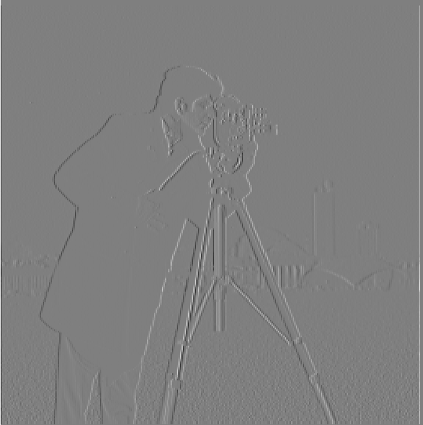
        
x direction gradient

    

    

        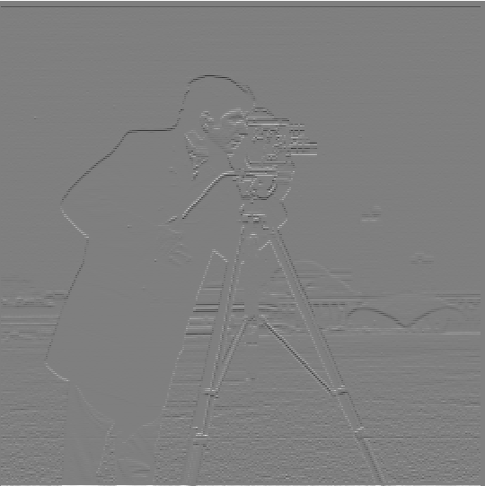
        
y direction gradient

    

    

        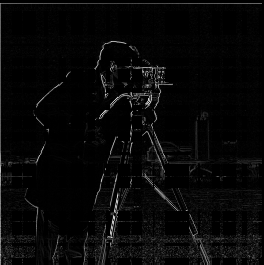
        
all direction gradient

    

    

        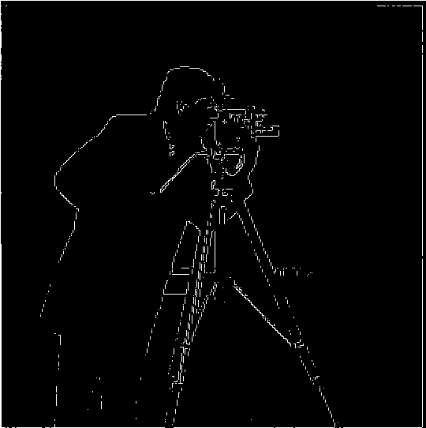
        
threshhold image

    

### Derivative of Gaussian (DoG) Filter

Therefore, I applied a low-pass filter with a Gaussian kernel of (12, 2) to the image, followed by binarization using a threshold of 15. The threshold was lowered because the gradient decreases after the low-pass filtering. However, this helps filter out a lot of noise, resulting in smoother and more continuous contours.

    

        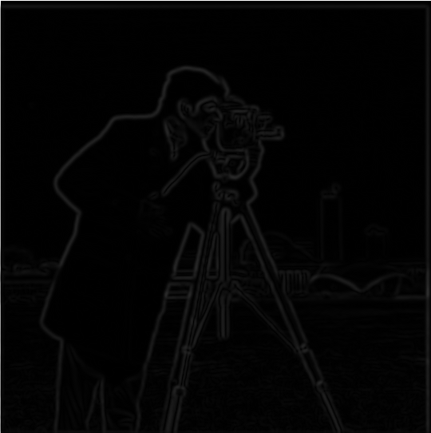
        
blurred image gradient

    

    

        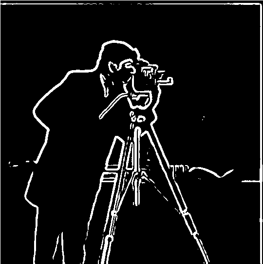
        
blurred image threshhold

    

## Part 2: Fun with Frequencies!

### Image "Sharpening"

Blur the image using a Gaussian filter: $I_{blurred}=I * G$, where $I$ is the original image, $G$ is the Gaussian filter.

The result of a sharpened image:
$$I_{sharpened}=(1+\alpha)\cdot I-\alpha\cdot(I*G)$$

You can control the sharpening intensity of the image by adjusting the value of $\alpha$. Here, I have chosen values of 0.5, 1.5, and 3.

    

        
        
raw image

    

    

        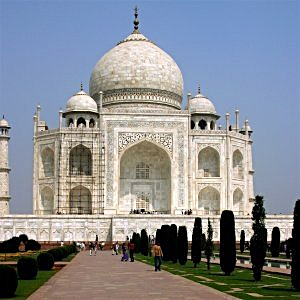
        
$\alpha=0.5$

    

    

        
        
$\alpha=1.5$

    

    

        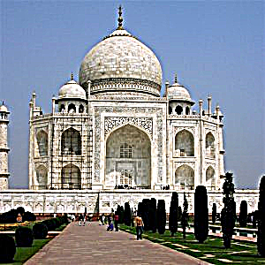
        
$\alpha=3$

    

#### Another cases

    

        
        
raw image

    

    

        
        
$\alpha=3$

    

    

        
        
raw image

    

    

        
        
$\alpha=3$

    

### Hybrid Images

To make the image blending more realistic, we first need to align the feature points of the two images. To achieve the effect where different content is seen at varying distances, we should separate the low-frequency and high-frequency components of each image. When viewed from a distance, the low-frequency part of the image is visible, while the high-frequency part is visible up close.

    

        
        
aligned derek

    

    

        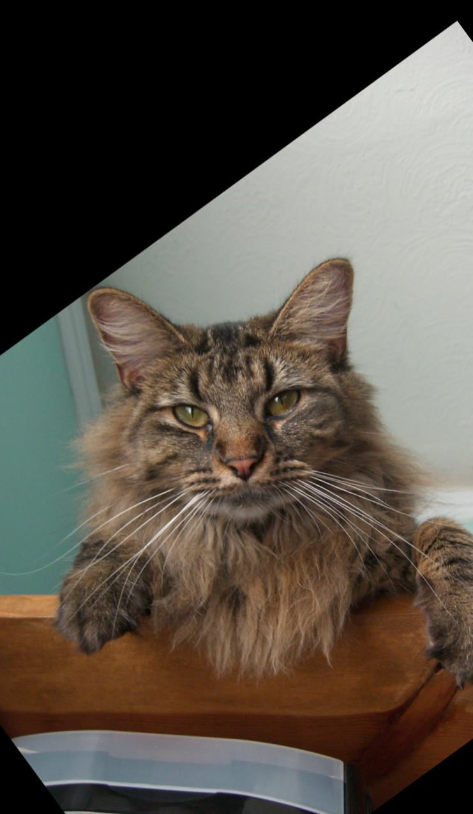
        
aligned nutmeg

    

    

        
        
low-pass derek

    

    

        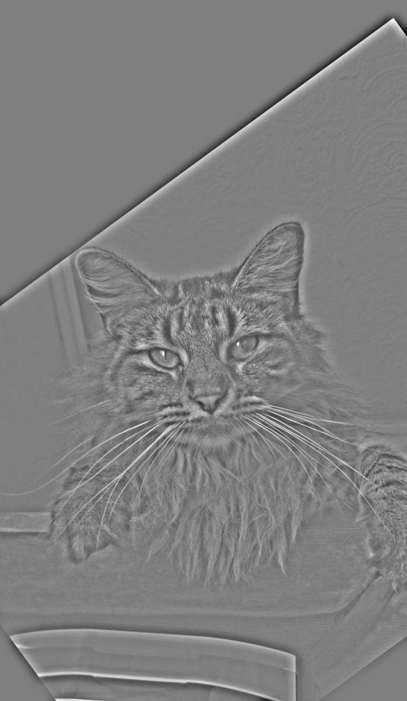
        
high-pass nutmeg

    

  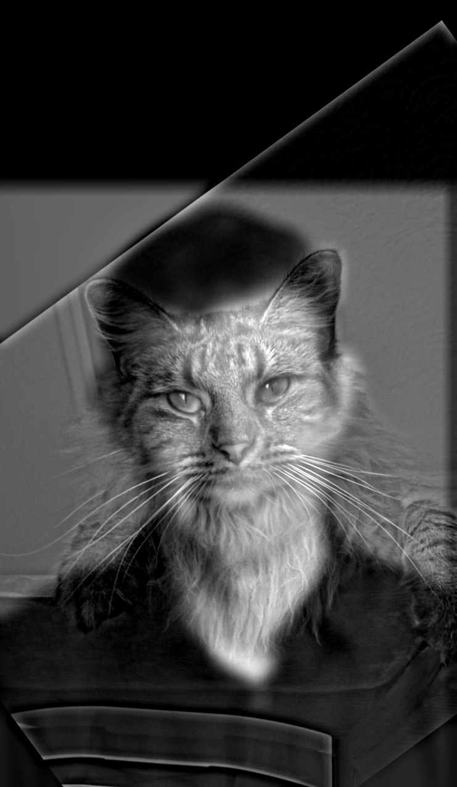
  
hybrid image

  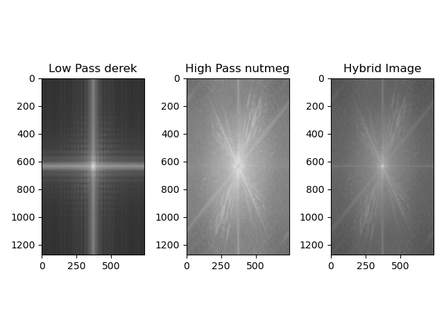
  
image spectrum

#### Another 2 cases (with one failure)

    

        
        
aligned Berkeley logo

    

    

        
        
aligned Stanford logo

    

  
  
hybrid image

    

        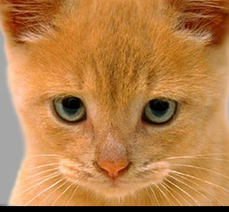
        
aligned cat

    

    

        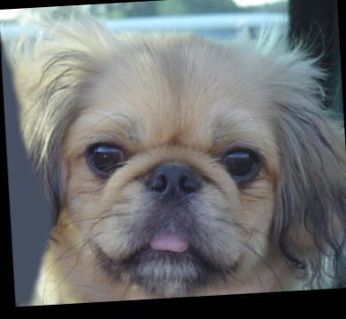
        
aligned dog

    

  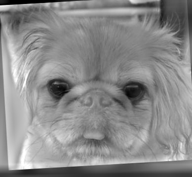
  
hybrid image

However, this is a failure case because too much of the cat's high-frequency information was lost, making it difficult to recognize the cat from a distance. The hybrid parameters need to be adjusted based on this case.

### Gaussian and Laplacian Stacks

Gaussian and Laplacian Stacks are multi-scale image representations commonly used in image processing and blending techniques.

Gaussian Stack: This is a set of progressively blurred versions of an image, created by applying Gaussian filters with increasing levels of smoothing. Each level in the stack captures the image at a lower resolution, preserving only low-frequency information.

Laplacian Stack: Derived from the Gaussian stack, the Laplacian stack highlights the high-frequency information (edges and fine details) by subtracting consecutive levels of the Gaussian stack. Each layer in the Laplacian stack represents the details lost between the blurred levels, allowing precise control over image blending and sharpening.

Here, I selected a Gaussian low-pass filter with a kernel size of 31 and a sigma of 7, using a six-level pyramid.

  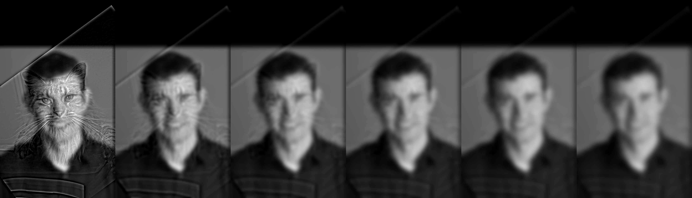
  
gaussian pyramid

  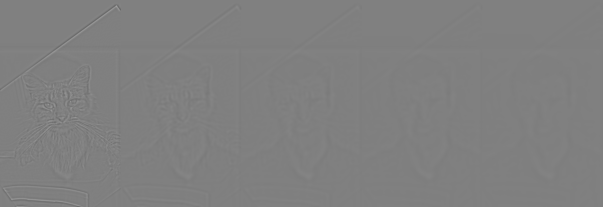
  
laplacian pyramid

### Multiresolution Blending (a.k.a. the oraple!)

To blend the two images more smoothly, I used a Laplacian stack combined with a progressively blurred mask. Here, I applied a Gaussian kernel with a size of 11 and a sigma of 3 in the Laplacian pyramid, and for the blurred mask, I used a Gaussian kernel with a size of 51 and a sigma of 11.

  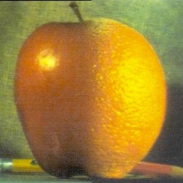
  
oraple

  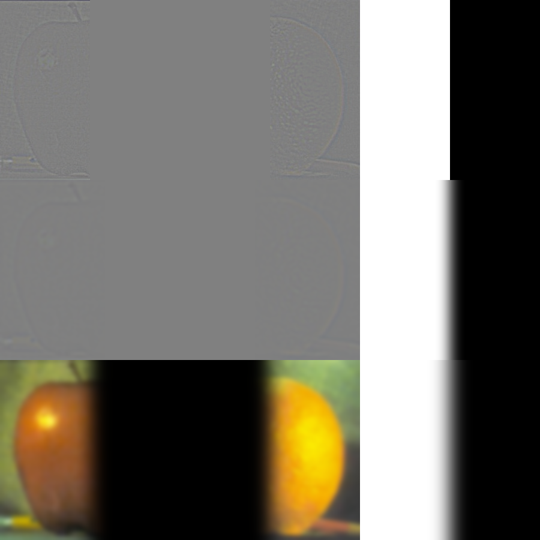
  
Column1, 2: the Laplacian stack for apple and orange. Column3: gradually blurred mask

#### Another 2 cases (with one irregular mask)

    

        
        
Biden

    

    

        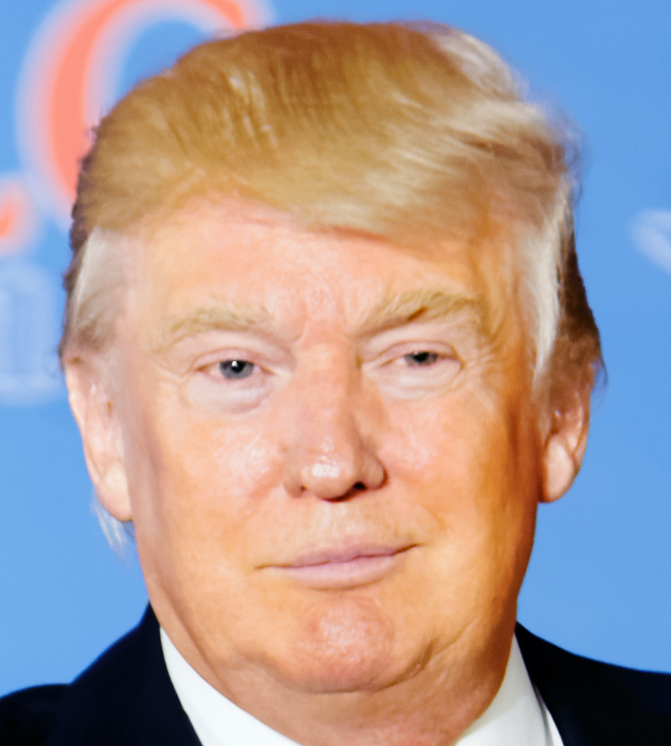
        
Trump

    

  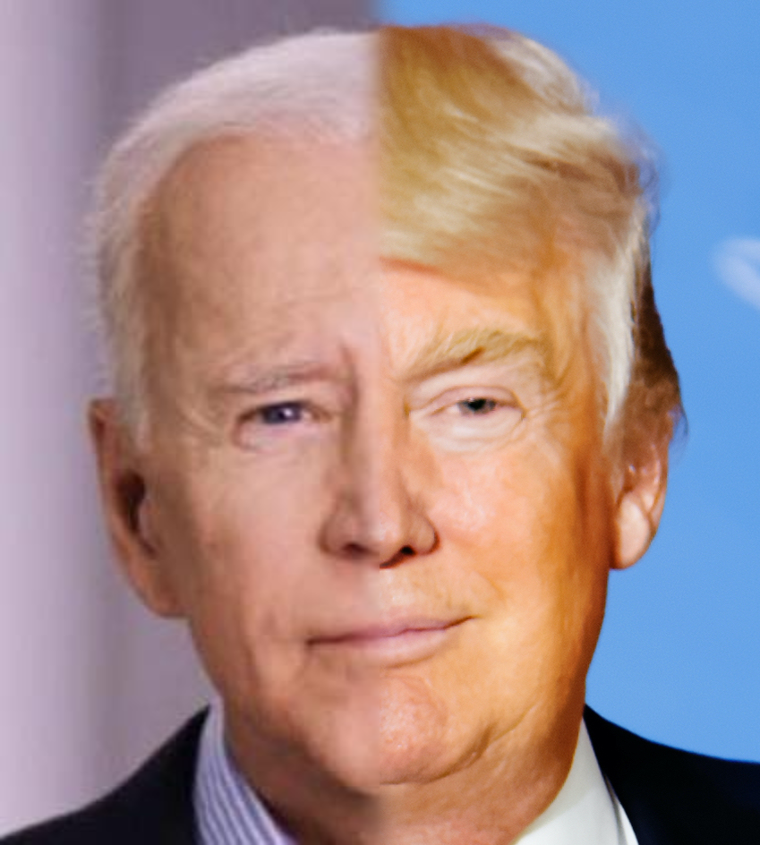
  
splined image

    

        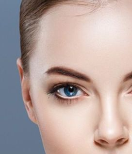
        
face

    

    

        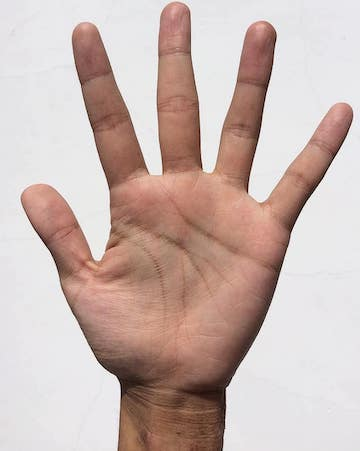
        
palm

    

    

        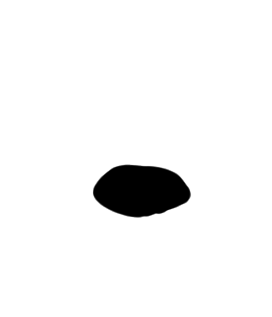
        
mask

    

    

        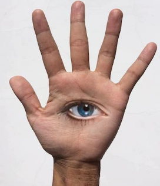
        
splined image

    

