## Part 1. Defining Correspondences

First, I used a labeling tool from a student project last year ([labeling tool](https://cal-cs180.github.io/fa23/hw/proj3/tool.html)). I manually added the four corners of an image because this allows for transforming the entire image. I applied triangulation to one image, and then transferred the triangulated vertices' indices to another image.

For matching, I selected Sam Altman and Yann LeCun. In the image below, the red dots represent the key points I marked, and the green lines illustrate the result of the triangulation.

    

        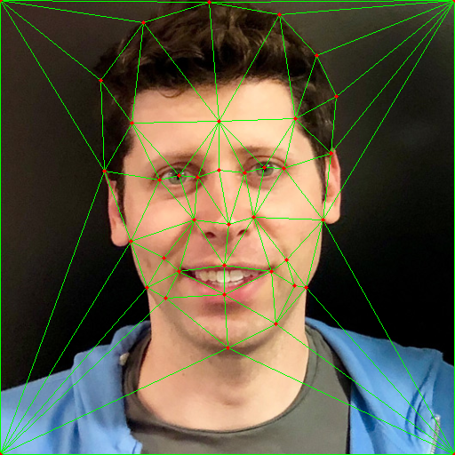
        
Triangulation resulf of Sam Altman

    

    

        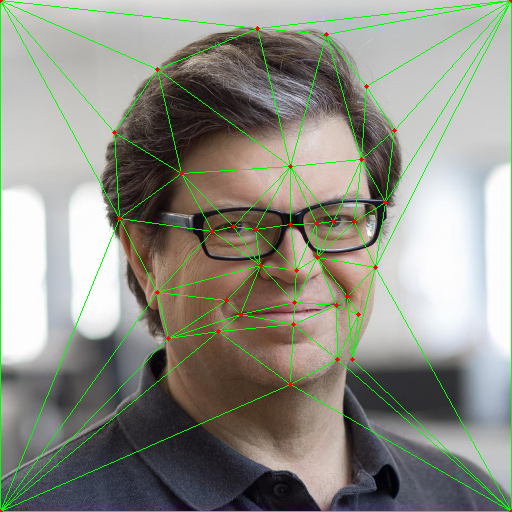
        
Triangulation resulf of Yann LeCun

    

## Part 2. Computing the "Mid-way Face"

First, we calculate the average position of each key point across the two images. Then, using affine transformations, we map the pixel values of the triangular regions from the original image to the new image. Finally, we average the pixel values from the two transformed images.

$$ x′=a⋅x+b⋅y+c $$
$$ 𝑦′=𝑑⋅𝑥+𝑒⋅𝑦+𝑓 $$

$$
T = 
\left(
\begin{matrix}
a & b & c \\
d & e & f \\
0 & 0 & 1
\end{matrix}
\right)
$$

    

        
        
Sam Altman

    

    

        
        
Yann LeCun

    

    
    
mid-way face of Sam Altman and Yann LeCun

## Part 3. The Morph Sequence

In this section, we perform a process similar to Part 2. However, we need to adjust the parameter $\alpha$ to control the cross-dissolve between the two images. For each frame of the video, $\alpha$ is calculated as $\alpha = \frac{currentframe}{totalframe}$, ensuring smooth transitions between frames.

    
    
morph sequence

## Part 4. The "Mean face" of a population

In this section, I used the [Danes dataset](https://web.archive.org/web/20210305094647/http://www2.imm.dtu.dk/~aam/datasets/datasets.html). I computed the average key point positions across all images and applied transformations to each image accordingly. By averaging the pixel values, I was able to generate the average appearance for the Danes dataset.

    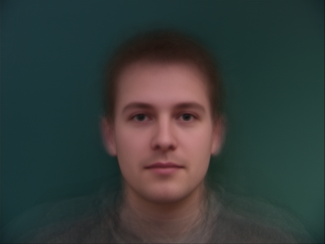
    
Danes mean face

Here are some examples morphing into the average face.

    

        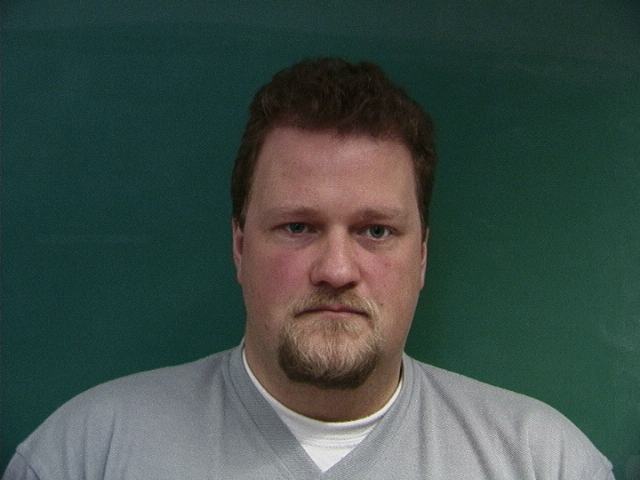
        
img1 original

    

    

        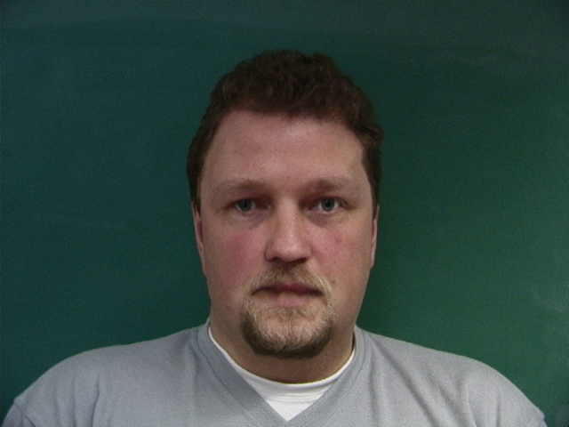
        
img1 morphed

    

    

        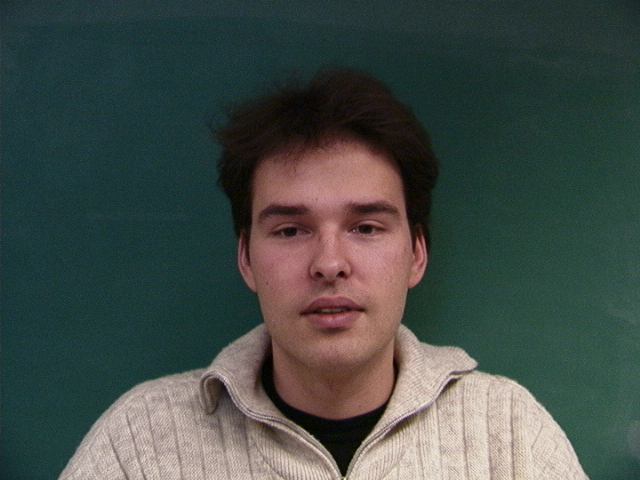
        
img3 original

    

    

        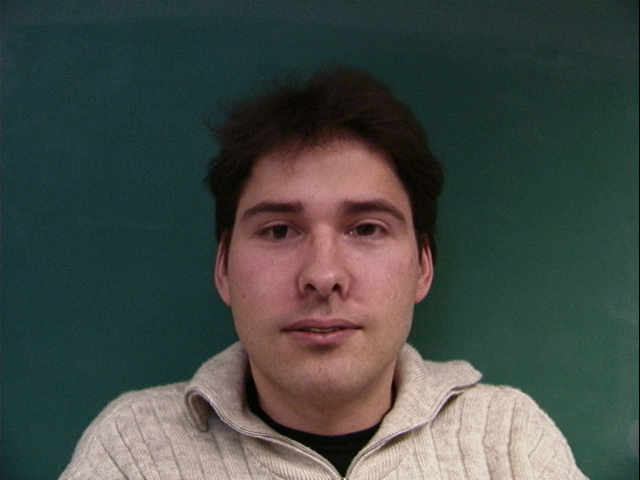
        
img3 morphed

    

    

        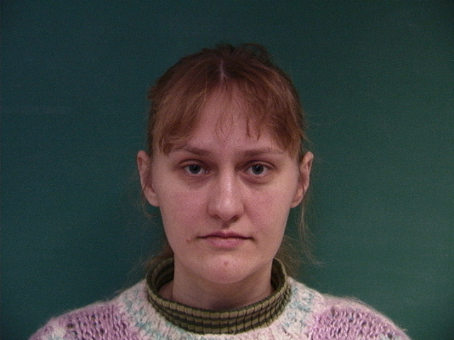
        
img4 original

    

    

        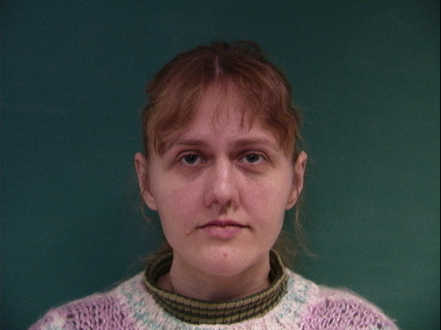
        
img4 morphed

    

Next, I followed the same annotation method to mark the keypoints of my face and morph it into average face.

    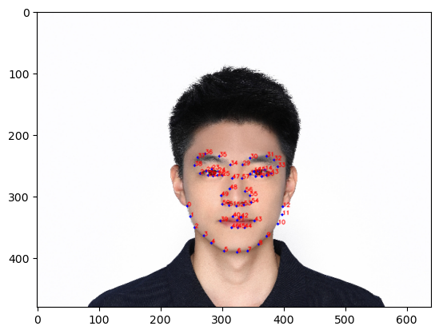
    
keypoints on my face

The following show my face warped into the average geometry, and the average face warped into your geometry.

    

        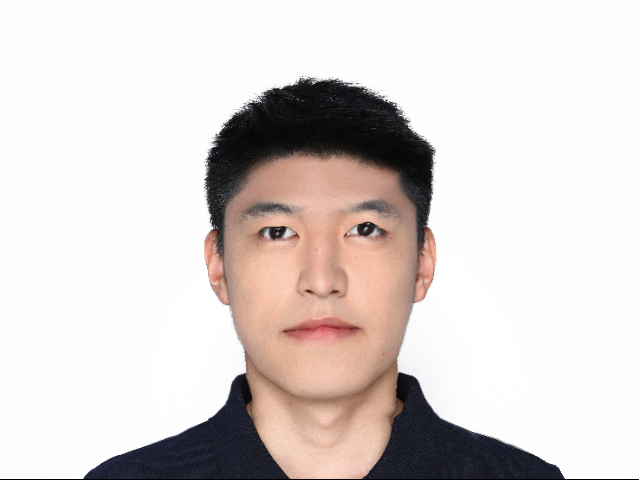
        
my face warped into the average geometry

    

    

        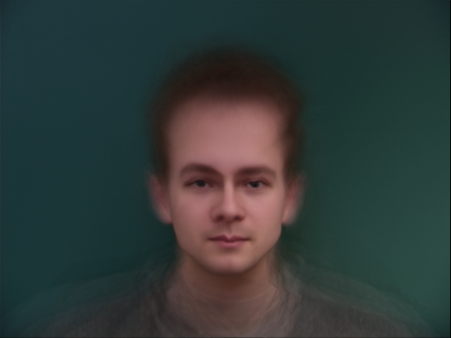
        
the average face warped into your geometry

    

## Part 5. Caricatures: Extrapolating from the mean

Let's say the keypoints of your face are denoted as F and the mean face keypoints are M. The difference between your face and the mean is $D = F - M$.
To create a caricature, you extrapolate beyond this difference by scaling the difference vector. For example, the caricature face C could be computed as: $𝐶=𝑀+\alpha×𝐷$. where $\alpha>1$ to exaggerate features (i.e., making a caricature) and $\alpha<1$ to soften them (i.e., making your face more "average").

    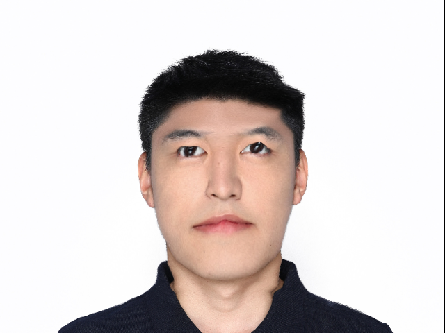
    
α=1.5

## Bells and Whistles

I blended my face with the average Danes features to make my facial distribution more similar to that of the Danes.

    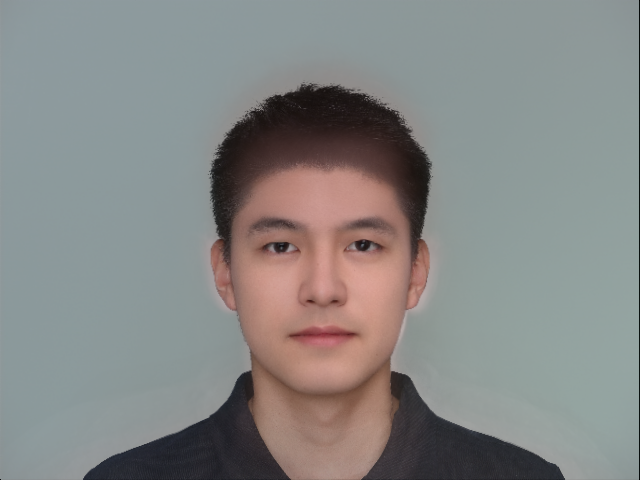
    
face changed to Danes

