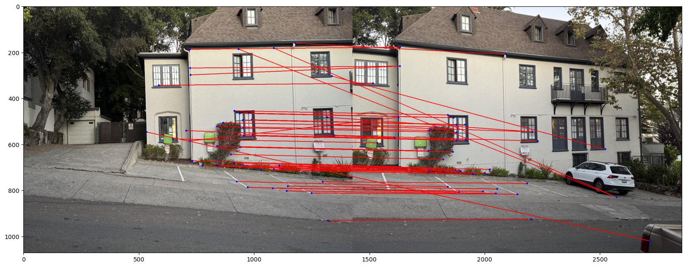

## Part A. Image Warping and Mosaicing

### Taking Images

All of these images were taken using an iPhone 15Pro on the street north of campus. Below are some images used in this project.

    

        
        

    

    

        
        

    

    

        
        

    

    

        
        

    

    

        
        

    

    

        
        

    

### Recovering Homographies 

To begin, we need to establish correspondence points between pairs of images. Let’s assume we have points $\vec{p}_i$ in image 1, which correspond to points $\vec{p}'_i$ in image 2.

Below are some images with corresponding key points.

    
    

    
    

    
    

We want to recover a projective transformation such that:

$$
\begin{bmatrix}
a & b & c \\
d & e & f \\
g & h & 1
\end{bmatrix}
\begin{bmatrix}
x \\
y \\
1
\end{bmatrix}=\begin{bmatrix}
wx' \\
wy' \\
w
\end{bmatrix}
$$

If we expand this out, we get the following system of equations:

$$
\begin{aligned}
&\left\{
\begin{aligned}
ax + by + c &= wx' \\
dx + ey + f &= wy' \\
gx + hy + 1 &= w
\end{aligned}
\right. \\
\implies &\left\{
\begin{aligned}
ax + by + c &= (gx + hy + 1) x' \\
dx + ey + f &= (gx + hy + 1) y'
\end{aligned}
\right. \\
\implies &\left\{
\begin{aligned}
ax + by + c - gx'x - hy'x &= x' \\
dx + ey + f - gx'y - hy'y &= y'
\end{aligned}
\right.
\end{aligned}
$$

This results in the following matrix form:

$$
\begin{bmatrix}
x & y & 1 & 0 & 0 & 0 & -xx' & -yx' \\
0 & 0 & 0 & x & y & 1 & -xy' & -yy'
\end{bmatrix}
\begin{bmatrix}
a \\
b \\
c \\
d \\
e \\
f \\
g \\
h
\end{bmatrix}=\begin{bmatrix}
x' \\
y'
\end{bmatrix}
$$

We can then solve for an approximate solution given an overconstrained system using least squares. We stack the various correspondence points in the matrix and the constant vector.

### Warping Images

First, obtain the coordinates of the four corner points of the input image, and use the homography matrix to transform these corner points, thereby determining the boundary range of the transformed image. Then, by applying the inverse homography matrix, map each pixel coordinate of the target image back to the input image. Using bilinear interpolation, calculate the pixel values of the transformed image. Meanwhile, a valid pixel mask is generated, and the completeness of the image is ensured by verifying the validity of each pixel.

With the warping process in place, we can also perform image rectification. We can choose four points to map onto a rectangle, adjusting the dimensions to ensure the output image maintains good resolution. The results of this rectification are shown below.

    

        
        

    

    

        
        

    

    

        
        

    

    

        
        

    

### Blending Images

The next step is to blend the images properly. To achieve this, we can utilize an alpha channel to identify where portions of a source image exist within the accumulated result. Additionally, a distance transform is applied to help seamlessly merge two projected images.

The distance transform assigns each pixel within a region (in this case, the bounding box of the projected image) a value based on its distance from the nearest edge. We'll use Euclidean distance for this calculation, and the final result is normalized to a range of 0 to 1.

Below is a visualization of a mask of shape 256*512:

    
    

In this case, the mask and the image should maintain the same shape (with simultaneous warping). During the blending process, the mask is used to perform a weighted average on the overlapping parts of the images in order to achieve a smooth transition between the two images.

The final results with full image blending are shown below.

    
    

    
    

    
    

-------------------------

## Part B: Feature Matching and Autostitching

### Corner Detection

Firstly, in order to find the interest points, we would like to first focus on the "corners" of the image. To find these corners, we use the Harris interest point detector, and use peaks in the matrix as the corner points.

    

        
        
Harris points in the image

    

    

        
        
Harris matrix

    

This part of the algorithm implements adaptive non-maximal suppression (ANMS) as described in the MOPS paper. The goal is to select interest points that are spaced sufficiently far apart from other points with significantly higher corner responses. Specifically, the algorithm calculates:

$$
r_i = \min_{i} |\vec{x}_i - \vec{x}_j| \quad \forall \vec{x}_j : h(\vec{x}_i) < c_{\text{robust}} h(\vec{x}_j)
$$

for each interest point. This formula determines the minimum distance between a given interest point and any other point with a substantially higher corner response. The algorithm then selects the top-K points based on this distance, ensuring that the chosen interest points are well-distributed across the image by eliminating many nearby points with weaker responses.

    
    
Harris points after ANMS

### Feature Extraction

As recommended in the paper, subsampling a larger patch around each interest point to create a feature descriptor enhances the descriptors' performance. However, to prevent aliasing, it is important to blur the image beforehand. This ensures that high frequencies above the Nyquist limit are filtered out before subsampling. In this basic implementation, an axis-aligned patch is used, and interest points or features are only detected at a single level of the Gaussian pyramid.

    
    
Flattened features

    
    
random corner examples

### Feature matching

After extracting the basic features, the pairwise distances between features in one image and those in another are calculated. To improve matching accuracy, the ratio of the error between the first nearest neighbor and the second nearest neighbor is computed and used as a threshold, following Lowe’s approach. This method offers better discriminatory power compared to thresholding based solely on the distance to the nearest neighbor.

    
    

### RANSAC

The correspondences obtained in the previous step are generally reliable, but some incorrect matches or outliers remain, which would significantly affect the quality of a least-squares solution if computed directly from these correspondences. To address this, a randomized consensus algorithm (RANSAC) is applied. In this process, random subsets of the matches are selected, and a homography is computed using a least-squares approach. The number of points that are "well-explained" by the homography (i.e., the L2 distance between the transformed point and the ground truth is small) are counted as inliers. The homography with the highest inlier count is selected as the best one. After identifying the inliers, a final least-squares homography is computed. From there, the image warping and stitching proceed in the same manner as described in the part A.

    
    
Keypoint pairs after RANSAC

    
    

### Result gallery

#### Case1:

    
    
Keypoint pairs

    
    
Keypoint pairs after RANSAC

    
    
Manually blend image

    
    
Auto blend image

#### Case2:

    
    
Keypoint pairs

    
    
Keypoint pairs after RANSAC

    
    
Manually blend image

    
    
Auto blend image

#### Case3:

    
    
Keypoint pairs

    
    
Keypoint pairs after RANSAC

    
    
Manually blend image

    
    
Auto blend image

