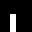

## Part A: The Power of Diffusion Models!

### Setup

For this project, I set the random seed to 180 manually to ensure reproducibility of the results. The DeepFloyd diffusion pipeline utilizes a multi-stage inference process. In Stage 1, images are generated at a resolution of 64x64, which results in lower quality. However, in Stage 2, the resolution is increased to 256x256, resulting in a significant improvement in quality. Each generated image accurately represents the description provided in the prompt, although there are slight imperfections in the eye area of the generated people. Additionally, I experimented with varying the number of inference steps. Increasing the inference steps leads to enhanced detail quality, but it also requires a trade-off with the substantially increased runtime.

#### Stage1 with 20 steps

    

        
        
an oil painting of a snowy mountain village

    

    

        
        
a man wearing a hat

    

    

        
        
a rocket ship

    

#### Stage2 with 20 steps

    

        
        
an oil painting of a snowy mountain village

    

    

        
        
a man wearing a hat

    

    

        
        
a rocket ship

    

#### Stage1 with 100 steps

    

        
        
an oil painting of a snowy mountain village

    

    

        
        
a man wearing a hat

    

    

        
        
a rocket ship

    

#### Stage2 with 100 steps

    

        
        
an oil painting of a snowy mountain village

    

    

        
        
a man wearing a hat

    

    

        
        
a rocket ship

    

## Sampling Loops

### Implementing the Forward Process

Firstly, we need to implement the forward process:

$$ x_t = \sqrt{\bar{\alpha_t}}x_0 + \sqrt{1-\bar{\alpha_t}}\epsilon$$

The following shows the results after adding noise at timesteps 250, 500, and 750.

    

        
        
raw image

    

    

        
        
t = 250

    

    

        
        
t = 500

    

    

        
        
t = 750

    

### Classical Denoising

Here, I applied the classic denoising method, Gaussian Blur, with a kernel size of 3 and a sigma of 0.8.

    

        
        
t = 250

    

    

        
        
t = 500

    

    

        
        
t = 750

    

    

        
        
t = 250

    

    

        
        
t = 500

    

    

        
        
t = 750

    

It can be observed that the images remain very blurred after applying Gaussian Blur, with no improvement in quality.

### One-Step Denoising

To retrieve the original image \( x_0 \) from the noisy image, we need to predict the noise \( \epsilon \) using DeepFloyd and then apply the transformation formula to reconstruct the original image:

$$ x_0 = \dfrac{x_t - \sqrt{1-\bar{\alpha_t}}\epsilon}{\sqrt{\bar{\alpha_t}}} $$

    

        
        
raw image

    

    

        
        
one-step t = 250

    

    

        
        
one-step t = 500

    

    

        
        
one-step t = 750

    

### Iterative Denoising

For iterative denoising, the first step is to create a series of strided timesteps. Here, I opted to start at 990 with a stride of 30, progressively decreasing until reaching 0.

$$
x_{t'} = \frac{\sqrt{\overline{\alpha}_{t'} \beta_t}}{1 - \overline{\alpha}_t} x_0 + \frac{\sqrt{\alpha_t (1 - \overline{\alpha}_{t'})}}{1 - \overline{\alpha}_t} x_t + v_{\sigma}
$$

Following the formula above, we progressively denoise the noisy image in steps. Below is a visualization of the iterative denoising process, showing the results at every fifth step.

    

        
        
t = 690

    

    

        
        
t = 540

    

    

        
        
t = 390

    

    

        
        
t = 240

    

    

        
        
t = 90

    

#### Comparison when t=690

    

        
        
raw image

    

    

        
        
Iterative Denoised

    

    

        
        
One-Step Denoised

    

    

        
        
Gaussian Blurred

    

From the results above, it's evident that iterative denoising significantly outperforms one-step denoising in terms of image quality, albeit at the cost of increased processing time.

### Diffusion Model Sampling

Here, I generated five random images using pure random noise with the prompt "a high quality photo".

    

        
        

    

    

        
        

    

    

        
        

    

    

        
        

    

    

        
        

    

Judging from the results, these five images lack significant semantic information and have relatively poor quality.

### Classifier Free Guidance

In CFG, we compute both a noise estimate conditioned on a text prompt, and an unconditional noise estimate. We denote these $\epsilon_c$ and $\epsilon_u$. Then, we let our new noise estimate be

$$\epsilon = \epsilon_u + \gamma (\epsilon_c - \epsilon_u)$$

Here, I used $\gamma=7$.

    

        
        

    

    

        
        

    

    

        
        

    

    

        
        

    

    

        
        

    

    

Compared to the previous Diffusion Model Sampling, the image quality here has improved significantly, with each image carrying distinct semantic information.

### Image-to-image Translation

In diffusion, adding varying levels of noise to an image enables image-to-image translation. As the noise level increases, the generated image diverges more from the original, allowing us to control the degree of translation. This approach provides flexible adjustment for the extent of transformation applied to the image.

    

        
        
1

    

    

        
        
3

    

    

        
        
5

    

    

        
        
7

    

    

        
        
10

    

    

        
        
20

    

    

        
        
raw image

    

#### Editing Hand-Drawn and Web Images

##### Web Image

    

        
        
1

    

    

        
        
3

    

    

        
        
5

    

    

        
        
7

    

    

        
        
10

    

    

        
        
20

    

    

        
        
raw image

    

##### Hand-Drawn 1

    

        
        
1

    

    

        
        
3

    

    

        
        
5

    

    

        
        
7

    

    

        
        
10

    

    

        
        
20

    

    

        
        
raw image

    

##### Hand-Drawn 2

    

        
        
1

    

    

        
        
3

    

    

        
        
5

    

    

        
        
7

    

    

        
        
10

    

    

        
        
20

    

    

        
        
raw image

    

#### Inpainting

Image inpainting can be achieved by denoising only one patch at a time while keeping the rest of the image unchanged. This approach allows us to modify specific areas while maintaining the style of the original image, enabling targeted edits that blend seamlessly with the original content.

#### Campanile

    

        
        
raw image

    

    

        
        
mask

    

    

        
        
to replace

    

    

        
        
inpainted

    

#### Hand-Drawn Image

    

        
        
raw image

    

    

        
        
mask

    

    

        
        
to replace

    

    

        
        
inpainted

    

#### Web Image

    

        
        
raw image

    

    

        
        
mask

    

    

        
        
to replace

    

    

        
        
inpainted

    

### Text-Conditional Image-to-image Translation

In the denoising process, adding a semantic condition can guide the content of the output. As the amount of added noise decreases, the results are increasingly controlled by the input image rather than the prompt. This allows for fine-tuning the influence of the input image versus the prompt, enabling more precise content manipulation based on the original image.

#### Campanile with prompt "a rocket ship"

    

        
        
1

    

    

        
        
3

    

    

        
        
5

    

    

        
        
7

    

    

        
        
10

    

    

        
        
20

    

    

        
        
raw image

    

#### Hand-Drawn 1 with prompt "an oil painting of people around a campfire"

    

        
        
1

    

    

        
        
3

    

    

        
        
5

    

    

        
        
7

    

    

        
        
10

    

    

        
        
20

    

    

        
        
raw image

    

#### Hand-Drawn 2 with prompt "an oil painting of a snowy mountain village"

    

        
        
1

    

    

        
        
3

    

    

        
        
5

    

    

        
        
7

    

    

        
        
10

    

    

        
        
20

    

    

        
        
raw image

    

### Visual Anagrams

To generate visual anagrams, we input two prompts simultaneously. One prompt guides the regular denoising of the image, while the other applies denoising to a flipped version of the image. Finally, we average the two noise predictions and denoise the image accordingly, achieving a result that carries semantic information from both the normal and flipped perspectives.

$$\epsilon_1 = \text{UNet}(x_t, t, p_1) $$
$$\epsilon_2 = \text{flip}(\text{UNet}(\text{flip}(x_t), t, p_2))$$
$$\epsilon = \frac{\epsilon_1 + \epsilon_2}{2}$$

    

        
        
an oil painting of an old man

    

    

        
        
an oil painting of people around a campfire

    

    

        
        
a rocket ship

    

    

        
        
a pencil

    

    

        
        
a lithograph of a skull

    

    

        
        
a man wearing a hat

    

### Hybrid Images

To generate hybrid images, we perform frequency separation on the noise predicted for each of the two prompts. This approach allows us to embed distinct semantic information in the high-frequency and low-frequency noise components. As a result, the generated image simultaneously contains both types of semantic information—one conveyed through high-frequency details and the other through low-frequency features.

$$\epsilon_1 = \text{UNet}(x_t, t, p_1)$$
$$\epsilon_2 = \text{UNet}(x_t, t, p_2) $$
$$\epsilon = f_{\text{lowpass}}(\epsilon_1) + f_{\text{highpass}}(\epsilon_2)$$

    

        
        
a lithograph of waterfalls

    

    

        
        
a lithograph of a skull

    

    

        
        
an oil painting of people around a campfire

    

    

        
        
an oil painting of an old man

    

    

        
        
a rocket ship

    

    

        
        
a pencil

    

### Bells & Whistles

An interesting observation is that DeepFloyd seems to have a bias toward generating human faces or bodies. In scenarios with no conditions or weak conditions, it frequently produces images of faces, likely due to an overrepresentation of faces in the dataset distribution.

I designed a course logo with prompt "Generate a high quality course logo. There is a rectangle sci-fi bounding box in the outermost, a robot eye in the right and fancy style text "CS180" in the left."

    

        
        
CS180 course logo

    

-------