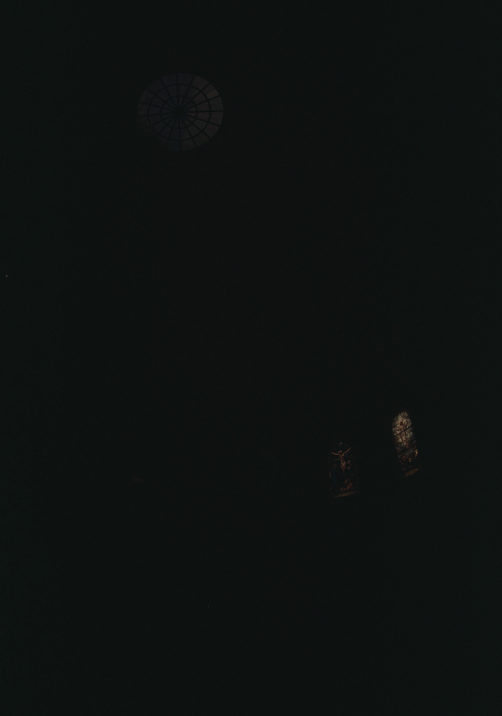
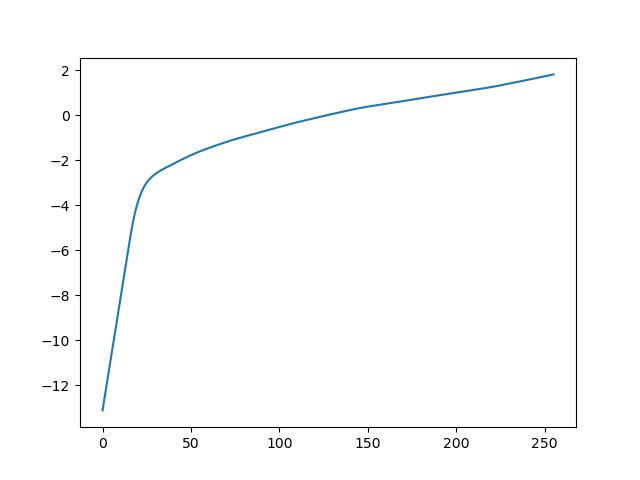

### Background
Modern cameras are unable to capture the full dynamic range of commonly encountered real-world scenes. In some scenes, even the best possible photograph will be partially under or over-exposed. Researchers and photographers commonly get around this limitation by combining information from multiple exposures of the same scene. You will write software to automatically combine multiple exposures into a single high dynamic range radiance map, and then convert this radiance map to an image suitable for display through tone mapping.

    

        
    

    

        
    

    

        
    

    

        
    

    

        
    

    

        
    

    

        
    

    

        
    

    

        
    

    

        
    

    

        
    

    

        
    

    

        
    

    

        
    

    

        
    

### Radiance map construction

The following algorithm comes from [Debevec and Malik 1997](https://www.pauldebevec.com/Research/HDR/debevec-siggraph97.pdf).

The observed pixel value $Z_{ij}$ for pixel $i$ in image $j$ is a function of unknown scene radiance and known exposure duration: $Z_{ij} = f(E_i \Delta t_j)$. $E_i$ is the unknown scene radiance at pixel i, and scene radiance integrated over some time $E_i \Delta t_j$ is the exposure at a given pixel. In general, $f$ might be a somewhat complicated pixel response curve. We will not solve for $f$, but for $g=ln(f-1)$ which maps from pixel values (from 0 to 255) to the log of exposure values: g$(Z_{ij}) = ln(E_i) + ln(t_j)$ (equation 2 in Debevec). Solving for $g$ might seem impossible (and indeed, we only recover g up to a scale factor) because we know neither $g$ or $E_i$. The key observation is that the scene is static, and while we might not know the absolute value of $E_i$ at each pixel $i$, we do know that the value remains constant across the image sequence.

Solving for $g$ is the tricky part. After we have $g$, is it straightforward to map from the observed pixels values and shutter times to radiance by the following equation (rearranged from above): $ln(E_i) = g(Z_{ij})-ln(\Delta t_j)$. 

To make the results robust, we want to consider two additional things:

- We expect $g$ to be smooth. Debevec adds a constraint to our linear system which penalizes $g$ according to the magnitude of its second derivative. Since $g$ is discrete (defined only at integer values from $g(0)$ to $g(255)$) we can approximate the second derivative with finite differences, e.g. $g''(x) = (g(x-1) - g(x)) - (g(x) - g(x+1)) = g(x-1) + g(x+1) - 2*g(x)$. We will have one such equation for each integer in the domain of $g$, except for $g(0)$ and $g(255)$ where the second derivative would be undefined.
  
- Each exposure only gives us trustworthy information about certain pixels (i.e. the well exposed pixels for that image). For dark pixels the relative contribution of noise is high and for bright pixels the sensor may have been saturated. To make our estimates of $E_i$ more accurate we need to weight the contribution of each pixel according to Equation 6 in Debevec. An example of a weighting function $w$ is a triangle function that peaks at $Z=127.5$, and is zero at $Z=0$ and $Z=255$. This is provided for you in the starter code. This weighting should be used both when solving for $g$ and when using $g$ to build the HDR radiance map for all pixels.

First, we calculate the response curve for each channel:

    

        
        
Red channel Response Curve

    

    

        
        
Green channel Response Curve

    

    

        
        
Blue channel Response Curve

    

Then, we use this curve to generate linear radiance map.

    

        
        
Red channel Radiance Map

    

    

        
        
Green channel Radiance Map

    

    

        
        
Blue channel Radiance Map

    

### Tone mapping

The following algorithm comes from [Durand 2002](http://people.csail.mit.edu/fredo/PUBLI/Siggraph2002/DurandBilateral.pdf).

Getting the radiance map is only half the battle. You want to be able to show off your image clearly. There are a few gobal tone-mapping operators to play with, such as $log(L)$, $sqrt(L)$, and $\frac{L}{L+1}$. Regardless of which transform you use, you'll want to stretch the intensity values in the resulting image to fill the [0 255] range for maximum contrast.

Once you see something reasonable using a global tone mapping operation, you'll need to implement a local method for full credit.

You'll be implementing a simplified version of Durand 2002. The steps are roughly as follows:

1. Your input is linear RGB values of radiance.
2. Compute the intensity (I) by averaging the color channels.
3. Compute the chrominance channels: (R/I, G/I, B/I)
4. Compute the log intensity: L = log2(I)
5. Filter that with a bilateral filter: B = bf(L)
6. Compute the detail layer: D = L - B
7. Apply an offset and a scale to the base: B' = (B - o) * s
    1. The offset is such that the maximum intensity of the base is 1. Since the values are in the log domain, o = max(B).
    2. The scale is set so that the output base has dR stops of dynamic range, i.e., s = dR / (max(B) - min(B)). I choose $dR=5$ and $\gamma=1/2.$ here.
8. Reconstruct the log intensity: O = 2^(B' + D)
9. Put back the colors: R',G',B' = O * (R/I, G/I, B/I)
10. Apply gamma compression.
    
First, we can visualize the result of bilateral filter:

    

        
        
Bilateral Filter visualization

    

Then, we can get a high dynamic range image:

    

        
        
Tone Mapping result

    

I also tried several tone mapping methods to compare with my method.
- Linear Mapping. Linearly mapping the radiance value into range(0, 255).
- Gamma Correction. $V_{out} = V_{in}^{\gamma}$ and then linearly mapping into range(0, 255). Here I choose $\gamma=1/2.$
- Log Transform. $V_{out} = \log V_{in}$ and then linearly mapping into range(0, 255).

    

        
        
Linear Mapping

    

    

        
        
Gamma Correction Mapping

    

    

        
        
Log Transform Mapping

    

    

        
        
Our Mapping

    

### Result Gallery

    

        
        
Arch

    

    

        
        
Bonsai

    

    

        
        
Garage

    

    

        
        
House

    

    

        
        
Mug

    

    

        
        
Window

    

### Bells & Whistles
